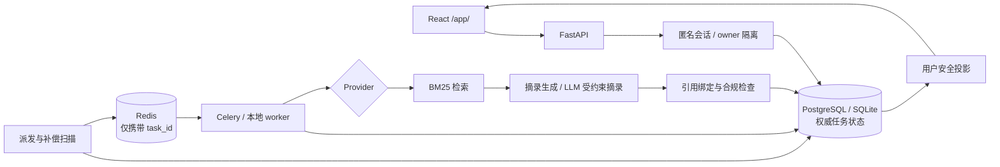

# MedCite

> 基于公开证据的医疗信息辅助分析原型：每条结论都能追溯到原文与来源，证据不足时明确弃答。

[](https://github.com/control-coder/medcite/actions/workflows/ci.yml)


> [!IMPORTANT]
> 本项目是工程原型，只处理公开资料与模拟输入，不提供诊断、处方或治疗建议，也不接收真实患者数据。

## 项目简介

用户提交一个健康相关问题，系统在公开语料中检索证据，由后台任务完成检索、生成、审核与结果投影，最终只展示能关联到原文片段的内容，并附上来源链接、局限与风险提示。找不到支持证据时，系统返回“证据不足”，而不是生成看似确定的回答。

项目重点在三件事：

- **可追溯引用**：每条展示内容都绑定到本次检索返回的原文片段；无引用的内容不会出现在结果页。
- **失败与弃答**：空检索在调用模型前停止；模型输出改写原文、引用未知片段、格式错误或被截断时一律拒绝。
- **任务一致性**：数据库是任务状态的唯一权威来源，消息队列只负责唤醒；重复投递、派发失败、worker 中断与取消后的迟到写入均有处理与测试。

## 功能特性

- React + TypeScript 四页应用：咨询提交、任务进度、结果与证据、历史记录；刷新页面可从后端恢复同一任务。
- FastAPI 模块化单体 + 独立 worker，支持 SQLite 本地演示，以及 PostgreSQL + Redis/Celery 服务模式。
- 状态机、幂等键、乐观锁（CAS）、租约与心跳、阶段产物恢复；数据库扫描补偿覆盖“提交成功但消息未发出”的窗口。
- 服务端签发匿名会话，所有接口按 owner 隔离，越权与不存在统一返回 404。
- 三种显式运行模式，互不静默切换：

  | 模式 | 检索 | 生成 | 用途 |
  | --- | --- | --- | --- |
  | `fake_offline` | 固定证据 | 确定性 fixture | 无依赖演示工程流程 |
  | `retrieval_mock` | 真实 BM25（中文双字切分） | 确定性原文摘录 | 默认演示，无需模型或密钥 |
  | `mimo_grounded` | 同上 | 真实 LLM 选择完整原文短引 | 有界预算的真实模型验证 |

- 真实模型调用通过持久化预算账本限流：先占额度再发请求，失败不退额、重启不重置、拒绝重定向。
- 独立研究评测子系统（`eval/`）：多专科 Agent 路由、BM25/向量/重排检索消融、NLI citation 评测与双人标注审计。

## 架构



设计取舍、一致性保证与已知限制见 [docs/architecture.md](docs/architecture.md)。

## 快速开始

环境要求：Python 3.11、Node.js 20.19+。默认演示不需要 Docker、模型下载或 API Key。

```bash
# 1. 安装依赖（推荐使用独立的 conda 环境）
conda env create -f environment.yml
conda activate medidiag
python -m pip install -e ".[dev]"
npm ci --prefix frontend
npm run build --prefix frontend

# 2. 使用独立的演示数据库并完成迁移
mkdir -p .cache/demo
export DATABASE_URL="sqlite:///./.cache/demo/public-demo.db"
export HF_HUB_OFFLINE=1 TRANSFORMERS_OFFLINE=1
python -m alembic upgrade head

# 3. 启动（API + 本地 worker 线程）
python -m medidiag.cli demo --provider retrieval_mock --app-config configs/application.yaml --port 8400
```

打开 <http://127.0.0.1:8400/app/>，点击“填入公开检索示例”并提交。Windows PowerShell 下用 `$env:DATABASE_URL = "..."` 设置环境变量。

PostgreSQL + Redis/Celery 服务模式、独立 worker、真实模型模式与排障见 [docs/development.md](docs/development.md)。

## 测试

```bash
ruff check .
mypy src
python -m pytest -q
# 端到端：新建数据库，启动独立 API/worker，并用浏览器（Edge）跑完整流程
python scripts/verify_offline.py --provider retrieval_mock --browser
```

CI 在每次推送到 `main` 和每个 Pull Request 上运行 ruff、mypy（strict）与 pytest。

## 评测结果

以下均为小规模工程验证，用于检查检索与弃答行为，不代表医学准确率。完整方法、逐例结果与原始报告见 [docs/evaluation.md](docs/evaluation.md)。

**公开中文语料检索**：8 篇 WHO 中文科普页面短引、16 条固定查询（dev/check 各 8 条），对比两种 BM25 分词。

| 分词 | Hit@3 dev | Hit@3 check | 无证据查询正确返回空 |
| --- | --- | --- | --- |
| 空格切分 | 0/6 | 0/6 | 4/4 |
| 中文双字切分 | 6/6 | 5/6 | 3/4 |

**真实模型端到端**：`mimo-v2.5`，5 条公开模拟问题，从页面提交到结果展示。2 条返回绑定原文的结果；1 条在证据片段缺少所需信息时由模型弃答；1 条空检索在调用模型前停止；1 条命中相关定义但模型保守弃答，作为已知限制保留。

## 项目结构

```text
src/medidiag/
  api/            HTTP 接口、匿名会话、用户安全投影、兼容 HTML 页面
  workflow/       状态机、任务领取与租约、派发补偿、worker、应用 Provider
  rag/            检索、分块、术语归一化
  review/  compliance/   引用审核与输出合规边界
  llm/  agents/   模型适配、预算账本、多专科 Agent 组件
  db/  observability/    数据模型、会话、结构化日志与追踪
frontend/         React + TypeScript + Vite 应用与 Playwright 测试
migrations/       Alembic 数据库迁移
configs/          应用运行配置
examples/         公开语料、固定查询与回归用例
scripts/          数据准备与端到端验证脚本
eval/             研究评测子系统（配置、数据集、标注）
artifacts/        评测报告与运行追踪
tests/            自动化测试
```

内部 Python 包、conda 环境与数据库沿用早期名称 `medidiag`。

## 文档

| 文档 | 内容 |
| --- | --- |
| [架构与取舍](docs/architecture.md) | 数据权威、任务一致性、用户隔离、检索与模型路线 |
| [API 与前端行为](docs/api.md) | 接口、输入约束、结果投影与失败语义 |
| [开发与运行](docs/development.md) | 安装、各运行模式、验证命令、演示路线与排障 |
| [评测与验证](docs/evaluation.md) | 检索对照、真实模型验证、失败案例与限制 |
| [研究评测协议](docs/research/evaluation-protocol.md) | formal 评测与人工 citation 复核流程 |
| [NLI 语言兼容性复盘](docs/research/nli-language-compatibility.md) | 历史评测中中英文混杂对 NLI 的影响 |
| [研究子系统](eval/README.md)、[报告索引](artifacts/reports/README.md) | 研究数据、标注与报告说明 |

## 局限

- 引用关联只证明内容可追溯到原文，不证明语义正确或医学适用；中文应用路径未使用 NLI 做语义审核。
- 匿名会话不支持账号找回或跨设备迁移；未做公网生产部署、多机容量与临床效果验证。
- 历史研究 formal 报告受中英文 NLI 输入混杂影响，相关指标仅作历史测量，见 [复盘](docs/research/nli-language-compatibility.md)。

## 许可证

本项目代码采用 [MIT License](LICENSE)。第三方组件与数据（HTMX、WHO 科普短引、PubMedQA、MedQA）的来源与使用条件见 [THIRD_PARTY_NOTICES.md](THIRD_PARTY_NOTICES.md)。
