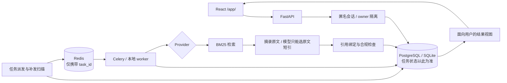

# MedCite

> 基于公开证据的医疗信息辅助分析原型：每条结论都能追溯到原文与来源，证据不足时明确弃答。

[](https://github.com/control-coder/medcite/actions/workflows/ci.yml)


> [!IMPORTANT]
> 本项目是工程原型，只处理公开资料与模拟输入，不提供诊断、处方或治疗建议，也不接收真实患者数据。

## 项目简介

用户提交一个健康相关问题，系统在公开语料中检索证据，由后台任务完成检索、生成、审核与结果投影，最终只展示能关联到原文片段的内容，并附上来源链接、局限与风险提示。找不到支持的证据时，系统返回“证据不足”，而不是生成看似确定的回答。

项目重点在三件事：

- **可追溯引用**：每条展示内容都绑定到本次检索返回的原文片段；无引用的内容不会出现在结果页。
- **失败与拒答**：检索不到内容时不调用模型，直接拒答；模型改写了原文、引用了不存在的片段、格式错误或输出被截断时，一律拒绝。
- **任务一致性**：任务状态以数据库为准，消息队列只负责通知 worker 有活要干；消息重复投递、消息没发出去、worker 中途挂掉、任务取消后才到的写入，都有处理并有测试。

## 功能特性

- React + TypeScript 前端，四个页面：咨询提交、任务进度、结果与证据、历史记录；刷新页面可从后端恢复同一任务。
- 后端是 FastAPI 单体应用加独立的 worker 进程，支持 SQLite 本地演示，以及 PostgreSQL + Redis/Celery 服务模式。
- 任务状态机；重复提交用幂等键去重；更新状态时先比较版本再写入（乐观锁）；worker 领取任务后在一段时间内独占（租约）并定期续约；各阶段结果落库，中断后可从断点继续；定时扫描数据库，补发“任务已保存但消息没发出”的情况。
- 服务端签发匿名会话，每个用户只能访问自己的数据；访问别人的或不存在的数据，一律返回 404。
- 三种显式运行模式，互不静默切换：

  | 模式 | 检索 | 生成 | 用途 |
  | --- | --- | --- | --- |
  | `fake_offline` | 固定证据 | 固定的模拟输出 | 无依赖演示工程流程 |
  | `retrieval_mock` | 真实 BM25（中文按相邻两字切分） | 固定规则摘录原文 | 默认演示，无需模型或密钥 |
  | `mimo_grounded` | 同上 | 真实 LLM 选择完整原文短引 | 有界预算的真实模型验证 |

- 真实模型调用有预算账本限额：先扣额度再发请求，失败不退还，重启后不重置，也不跟随重定向。
- 独立研究评测子系统（`eval/`）：多专科 Agent 路由、BM25／向量／重排检索的对比实验、用自然语言推理（NLI）模型检查引用是否支持结论，以及双人标注的核对。

## 架构



设计取舍、一致性保证与已知限制见 [docs/architecture.md](docs/architecture.md)。

## 快速开始

环境要求：Python 3.11、Node.js 20.19+。默认演示不需要 Docker、模型下载或 API Key。

```bash
# 1. 安装依赖（推荐使用独立的 conda 环境）
conda env create -f environment.yml
conda activate medidiag
python -m pip install -e ".[dev]"
npm ci --prefix frontend
npm run build --prefix frontend

# 2. 使用独立的演示数据库并完成迁移
mkdir -p .cache/demo
export DATABASE_URL="sqlite:///./.cache/demo/public-demo.db"
export HF_HUB_OFFLINE=1 TRANSFORMERS_OFFLINE=1
python -m alembic upgrade head

# 3. 启动（API + 本地 worker 线程）
python -m medidiag.cli demo --provider retrieval_mock --app-config configs/application.yaml --port 8400
```

打开 <http://127.0.0.1:8400/app/>，点击“填入公开检索示例”并提交。Windows PowerShell 下用 `$env:DATABASE_URL = "..."` 设置环境变量。

PostgreSQL + Redis/Celery 服务模式、独立 worker、真实模型模式与排障见 [docs/development.md](docs/development.md)。

## 测试

```bash
ruff check .
mypy src
python -m pytest -q
# 端到端：新建数据库，启动独立 API/worker，并用浏览器（Edge）跑完整流程
python scripts/verify_offline.py --provider retrieval_mock --browser
```

CI 在每次推送到 `main` 和每个 Pull Request 上运行代码风格检查（ruff）、类型检查（mypy 严格模式）和测试（pytest）；另有一个浏览器端到端检查（真实 API、独立 worker、Playwright 控制的 Chromium 浏览器，使用 `retrieval_mock` 模式，不需要模型和密钥）。

## 评测结果

以下都是小规模的工程验证，用来检查检索和“证据不足时拒绝回答”的行为，不代表医学准确率。完整方法、逐条结果和原始报告见 [docs/evaluation.md](docs/evaluation.md)。

先说明几个词：

- **Hit@3**：前 3 条检索结果里含有正确片段的问题所占比例。
- **拒答**：系统判断证据不够，不给答案。
- **误答率**：本来不该回答的问题里，被回答了的比例，越低越好。
- **该答却拒答率**：本来可以回答的问题里，被拒绝的比例，越低越好。
- **BM25**：一种按关键词字面匹配打分的检索方法。**向量检索**：把文字转成数字向量，按语义相似度找片段。

### 1. 公开中文语料检索

8 篇 WHO 中文科普页面的短引，16 条固定问题（调参用和检查用各 8 条），对比两种 BM25 切词方式。

| 切词方式 | Hit@3（调参组） | Hit@3（检查组） | 无证据的问题正确返回空 |
| --- | --- | --- | --- |
| 按空格切分 | 0/6 | 0/6 | 4/4 |
| 中文按相邻两字切分 | 6/6 | 5/6 | 3/4 |

### 2. 扩大语料后的检索与拒答

语料扩到 51 篇 WHO 中文页面的 178 条逐字短引，共 168 条问题（可回答 112、不可回答 56）。参数只在调参组上选，在测试组上报告，比例带 95% 置信区间。问题由 AI 辅助撰写，不是盲测。

| 方案（测试组） | Hit@3 | 口语换说法的问题 Hit@3 | 误答率 | 该答却拒答率 |
| --- | --- | --- | --- | --- |
| BM25，有字面命中就回答（应用当前做法） | 0.70 [0.57, 0.80] | 6/21 | 0.93 | 0.02 |
| BM25，加得分门槛 | 同上 | 同上 | 0.07 | 0.48 |
| 向量检索，加得分门槛 | 0.96 [0.88, 0.99] | 20/21 | 0.25 | 0.18 |

- 应用当前的规则在 28 条不可回答的问题里回答了 26 条，几乎不拒答。
- 向量检索对“换种说法”的问题帮助很大，但“主题相关、其实没答案”的问题仍有约一半被回答。
- 语料变大时，BM25 的 Hit@3 从 0.79（8 篇）降到 0.68（51 篇），向量检索基本不变（0.99 到 0.97）。
- 这一组只在评测里做，应用本身仍然只用 BM25。

### 3. 多进程故障注入压测

4 个 worker 进程处理 60 个病例，运行中随机强制结束进程 8 次、暂停进程 2 次，SQLite 和 PostgreSQL 各用 3 个随机种子。处理阶段是固定耗时的模拟实现，不联网、不花钱，Redis/Celery 不在这组测试里。

- **第一轮（修复前）**：360 个病例全部成功，没有丢任务，没有重复的报告和阶段结果，暂停后恢复的旧进程写入都被拒绝。被中断的那一步会重新执行，所以结果是“至少执行一次、只提交一次”。
- **发现的问题**：同一个任务有时被反复接手，接手次数比注入的故障次数还多（17 次对 10 次），且本地 worker 没有次数上限。
- **修复后**：每次只接手一个任务并立即执行，并给每个任务设了最多 3 次的执行上限，超过后转人工处理。SQLite 三轮的接手次数正好等于 10 次故障，吞吐从每秒 1.95 到 2.28 个病例提高到 2.50 到 2.56 个。
- **仍有一个问题没查清**：PostgreSQL 三轮的接手次数都比故障多 1 到 2 次；其中一轮有 1 个病例碰到上限转了人工，该轮 59/60 成功，报告按实际结果保留为未通过。没有出现重复报告或重复阶段结果。

吞吐等数字由固定延迟和 3 秒租约决定，只能用来比较，不是容量指标。

### 4. 真实模型：拒答、改写问题和重复问

用 `mimo-v2.5` 在测试组（可回答 56、不可回答 28）上做的评测，第一次录制 559 次请求，之后补做重问又花了 29 次，合计 588 次（上限 800）。把检索到的前 3 条证据交给应用现有的“只能逐字摘录原文”生成流程。请求和回复已存成文件放进仓库，CI 不联网也能重放并核对结果。

- **不该答的问题几乎不会被答**：误答 0/28。作为对比，应用当前规则是 0.93，向量检索加门槛是 0.25。
- **代价是有些该答的问题被拒**：BM25 前 3 条下约 30% 到 38%；向量检索前 3 条只有约 5%。
- **模型输出有时不合格**（摘录不是原文、引用错误或格式不对），应用会直接拒绝。BM25 每次 4 到 6 条，向量检索 12 条，都出现在可回答的问题上。
- **同一请求再问一次**：第一次不合格时重问一次，33 次里有 23 次第二次就合格。向量检索下“作答且选对片段”的问题从 41/56 升到 51/56（0.91）；BM25 条件从 34、28、32 升到 36、33、33，BM25 加改写从 37 升到 42。不该答的问题仍是 0/28 误答。这个重问只在评测里做，应用没有这个功能。
- **先让模型把问题改写一遍再检索**：口语换说法的问题 Hit@3 从 6/21 升到 17/21（新命中 11 条，丢失 0 条）。
- **答案不稳定**：同一请求问 3 次，回答与否完全一致的只有 83%，所以单次差异小于约 0.1 的比较不可信。

### 5. 真实模型端到端

用 `mimo-v2.5` 跑 5 条公开模拟问题，从页面提交到看到结果：2 条返回了绑定原文的结果；1 条证据里缺少所需信息，模型拒答；1 条没有检索结果，没调用模型就拒答；1 条检索到了相关定义但模型保守拒答，作为已知限制保留。

## 项目结构

```text
src/medidiag/
  api/            HTTP 接口、匿名会话、用户安全投影、兼容 HTML 页面
  workflow/       状态机、任务领取与租约、派发补偿、worker、应用 Provider
  rag/            检索、分块、术语归一化
  review/  compliance/   引用审核与输出合规边界
  llm/  agents/   模型适配、预算账本、录像带录制回放、多专科 Agent 组件
  db/  observability/    数据模型、会话、结构化日志与追踪
frontend/         React + TypeScript + Vite 应用与 Playwright 测试
migrations/       Alembic 数据库迁移
configs/          应用运行配置
examples/         公开语料、固定查询与回归用例
scripts/          数据准备与端到端验证脚本
eval/             研究评测子系统（配置、数据集、标注）
artifacts/        评测报告与运行追踪
tests/            自动化测试
```

内部 Python 包、conda 环境与数据库沿用早期名称 `medidiag`。

## 文档

| 文档 | 内容 |
| --- | --- |
| [架构与取舍](docs/architecture.md) | 数据权威、任务一致性、用户隔离、检索与模型路线 |
| [API 与前端行为](docs/api.md) | 接口、输入约束、结果投影与失败语义 |
| [开发与运行](docs/development.md) | 安装、各运行模式、验证命令、演示路线与排障 |
| [评测与验证](docs/evaluation.md) | 检索对照、故障压测、真实模型验证、失败案例与限制 |
| [研究评测协议](docs/research/evaluation-protocol.md) | formal 评测与人工 citation 复核流程 |
| [NLI 语言兼容性复盘](docs/research/nli-language-compatibility.md) | 历史评测中中英文混杂对 NLI 的影响 |
| [研究子系统](eval/README.md)、[报告索引](artifacts/reports/README.md) | 研究数据、标注与报告说明 |

## 局限

- 引用关联只证明内容可追溯到原文，不证明语义正确或医学适用；中文应用路径未使用 NLI 做语义审核。
- 模型拒答、问题改写、向量检索和失败后重问只在评测里验证，应用本身仍然只用 BM25 加摘录原文；评测问题由 AI 辅助撰写，不可回答的问题只有 28 条。
- 匿名会话不支持账号找回或跨设备迁移；未做公网生产部署、多机容量与临床效果验证。
- 历史研究 formal 报告受中英文 NLI 输入混杂影响，相关指标仅作历史测量，见 [复盘](docs/research/nli-language-compatibility.md)。

## 许可证

本项目代码采用 [MIT License](LICENSE)。第三方组件与数据（HTMX、WHO 科普短引、PubMedQA、MedQA）的来源与使用条件见 [THIRD_PARTY_NOTICES.md](THIRD_PARTY_NOTICES.md)。
