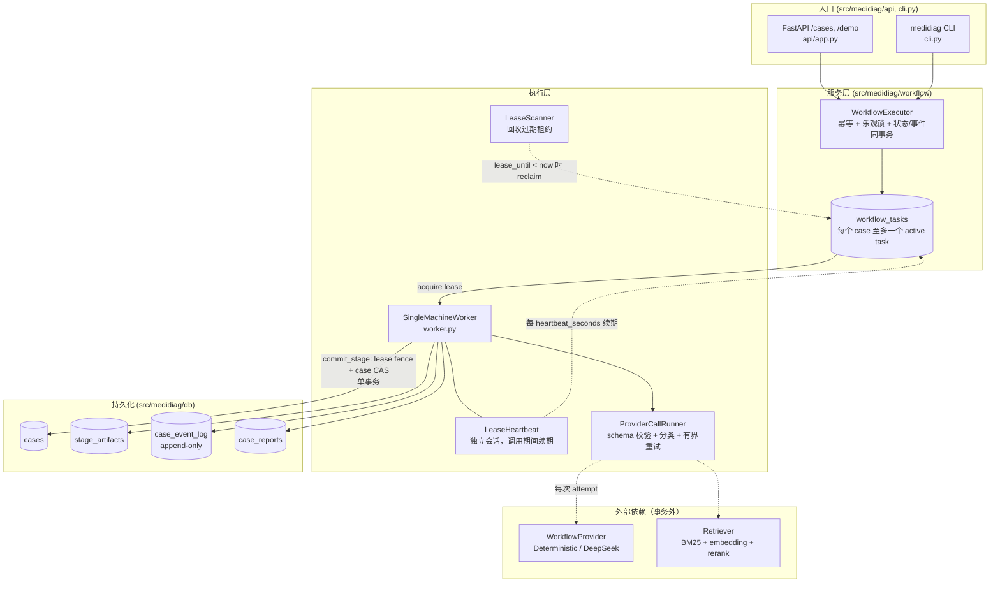
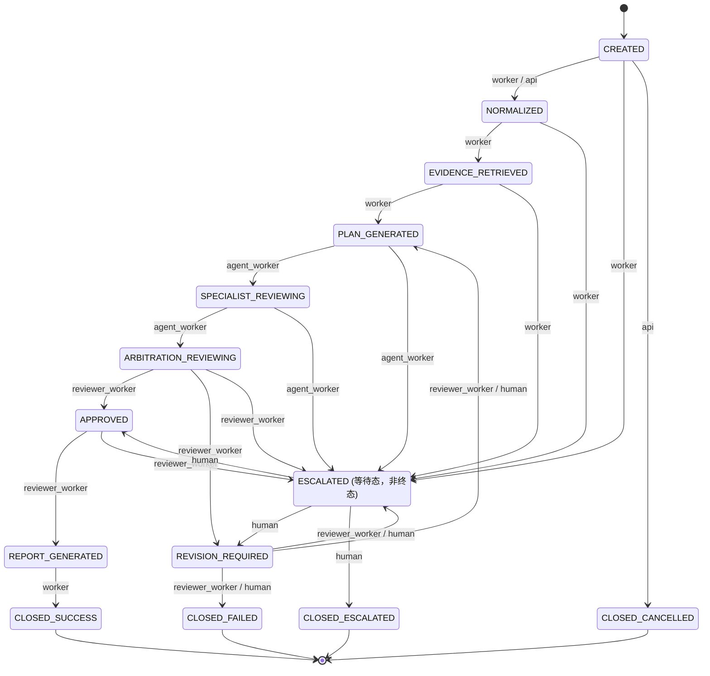
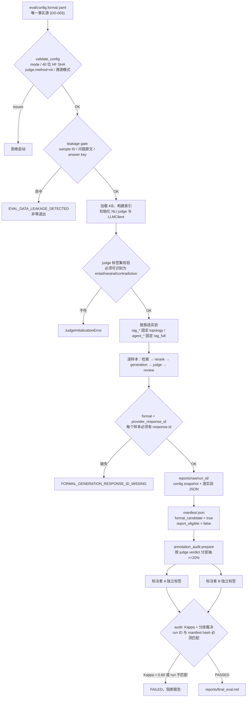
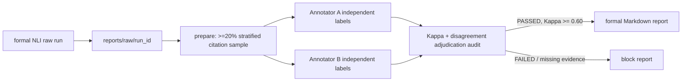

# MediDiag 架构说明

> 更新日期：2026-07-23。本文区分当前已实现组件、演示边界和一期目标链路。

## 当前实现边界

当前仓库包含：

- 状态机与执行器原型：14 状态、触发主体、非法跳转、状态+事件事务接口。
- 数据层：cases、workflow_tasks、case_event_log、agent_runs、citations、reviews、stage_artifacts、case_reports。
- 并发机制原型：幂等服务、乐观锁重试、租约 acquire/renew/reclaim 与迟到写入检查。
- RAG/Agent 组件：术语归一化、BM25、embedding、evidence weighting、rerank、单/双 Agent 和仲裁。
- 审核组件：citation、clinical logic、compliance 规则。
- 评测链路：配置验证、实验隔离、leakage gate、raw provenance 和指标聚合。
- P0-C 单机闭环：六个 FastAPI API、单机 worker、lease scanner、人工回流和结构化报告。
- Provider runtime：阶段 schema、timeout/HTTP 错误映射、有限退避和逐 attempt 事件审计。
- P1-A observability：统一 trace schema、raw/summary exporter 与四类确定性工程案例，其中第四类是双专科无明确收益的负向 fixture。
- P1-B demo：FastAPI 服务端模板、Jinja2、vendored HTMX、响应式 CSS 和原生表单 fallback。
- P2 评测门禁：基于 actual raw run 的 20% citation 模板、双人标注/Kappa/裁决审计和自动报告阻断。

当前 P0-C 以确定性非诊断 provider 验证事务、恢复和 API 契约；演示路径另已接入 DeepSeek 官方 generation adapter。DeepSeek provider 的 retrieval 仍使用明确标注的本地 fixture，citation 判定仍不是固定 NLI。客户端已实现稳定公共前缀与自动缓存 usage 遥测，但没有自建缓存层；正式单 Agent 与双专科对照实验仍未交付。

## 请求路径

下图只画已实现的组件，与 `src/medidiag/` 一一对应；虚线是事务外的外部 IO
（DD-002），实线是同事务写入。



租约 fence 是唯一的脑裂防护：`commit_stage` 的条件 UPDATE 同时校验
task_id、lease_owner、attempt、`status=RUNNING` 与 `lease_until > now`，
未命中即丢弃本次外部调用结果并追加 `TASK_LEASE_LOST`。

## 状态机

14 个状态，定义在 `workflow/state_machine.py`。每条边都标注触发主体；
`TRANSITIONS` 表是唯一事实源，下图与之对应。



三条约束值得单独说明：

- **每个执行状态都有一条 ESCALATED 出边**，因此任何阶段的 provider 失败都不会
  把 case 留在中间态死等；`_STAGE_BY_STATE` 保证失败边使用状态机接受的触发主体。
- **`ESCALATED` 只能由 `human` 回流**，system 与 worker 都无权推进它。
- **`REVISION_REQUIRED -> PLAN_GENERATED` 的环由复核轮次上限截断**：达到
  `max_review_rounds` 后改判 `ESCALATED` 并记 `MAX_REVIEW_ROUNDS_EXCEEDED`。

## 事务边界

1. 短事务创建/领取任务，提交状态与 event。
2. 事务外执行 RAG/LLM/judge；所有调用设置 timeout、错误码与有限重试。
   - timeout 按 stage 映射为 RAG/LLM/judge 错误；429 与瞬时 5xx 有限重试。
   - schema 与其他 4xx 不自动重试；未知异常保留 crash/reclaim 语义。
   - 每次 attempt 单独追加 request ID、latency、error code 与 retry decision 事件。
3. 单条条件 UPDATE 校验 task ID、owner、attempt、RUNNING 和有效 lease。
4. 命中后在同一事务写阶段产物、推进 case version/status 并追加 event。
5. 未命中则丢弃旧结果，并在独立事务追加 `TASK_LEASE_LOST`。

步骤 3-5 的数据库原子 CAS 已在 P0-B 落盘并由模型、executor、lease 与迁移测试覆盖。它只证明单机 SQLite 条件更新语义，不代表多 worker 生产部署能力。

## 评测门禁链

每个菱形都是硬门禁：不通过就终止，不降级、不产出可报告数值。



`formal_candidate` 与 `report_eligible` 是两件事：runner 只能置前者，后者必须由
一份 run ID 匹配、状态为 `PASSED` 的人工 citation audit 授予（DD-015）。因此
「配置全部合法且 run 成功结束」不足以产出正式报告。

RAG 和 Agent 实验不能复用同一标识：

- `rag_*` 只评估检索/审核组件，生成 topology 固定为 single。
- `agent_*` 固定 `rag_full`，只比较 single/fixed_pair/dynamic_pair。

## 当前 raw 语义

- `pipeline_approval_rate`：规则/审核流水线是否通过，仅用于组件实验。
- `workflow_success_rate`：必须来自数据库终态 `CLOSED_SUCCESS`；当前 eval runner 输出 `null`。
- development run：允许快速验证，但 manifest 明确不可报告。
- formal run：固定 NLI 和不可变版本，禁止 fallback、limit 与 dry-run；raw manifest 仅为 `formal_candidate`，通过匹配的人工 citation audit 后才可报告。

## 当前持久化产物

- normalize artifact：归一化输入与词表版本。
- retrieval artifact：query、top-k、各分数、模型和配置 hash。
- agent_runs：输入 hash、attempt group 和结构化输出。
- citations：claim-citation pair 和 judge metadata。
- reviews：轮次、问题、判定与升级原因。
- case_reports：结构化报告、风险提示、合规状态和生成版本。
- case_event_log：append-only 事件，不作为业务结果的唯一存储。

`provider_call` 事件保存 trace/task 关联、provider version、provider attempt、request ID、latency、错误码、retryable、retry decision 和 HTTP status；DeepSeek generation metadata 只保留模型标识与非敏感 token/cache usage，不保存 API key、prompt、病例正文或完整 provider 响应。成功阶段的 `stage_completed` 事件额外保存最终 request ID 与 retry count。

每个 stage artifact 使用 `(case_id, task_id, stage, attempt)` 唯一约束，并保存 input/output hash、component version 和 latency。provider 调用发生在事务外；写入由 `commit_stage()` 将 lease fence、case CAS、artifact 和 event 合并进同一事务。

## Trace 导出边界

`TraceExporter` 读取 append-only event，并关联 task、artifact、agent run 与 report：

```text
case_event_log + workflow_tasks + stage_artifacts + agent_runs + case_reports
  -> normalized raw events (traces/raw/<trace_id>.jsonl)
  -> redacted summary (traces/summary/<trace_id>.json)
```

raw 与 summary 都不保存病例问题；summary 进一步移除 evidence text 和 claim text，只保留 evidence 元数据与 claim hash。敏感键、Bearer token、邮箱、手机号和身份证格式统一脱敏。summary 的 `raw_event_ids` 与 `raw_file` 提供反向关联。运行产物默认不提交 Git。

## 演示页数据流

```text
Browser
  -> Jinja2 full page (/demo, /demo/cases/{id})
  -> HTMX status partial every 2s while active
  -> existing schema/deidentification/executor boundary for writes
  -> SQLAlchemy read model for evidence, review, report and timeline
```

HTMX 以固定本地 2.0.4 文件提供，不依赖外网 CDN。创建、人工处置和恢复表单同时声明原生 `method/action`；禁用 JavaScript 时由 303 返回完整页面。模板不直接执行 UPDATE，状态变化仍通过 `WorkflowExecutor`。该页面是本地工程入口，不是患者端或生产 Dashboard。

## 部署与隐私边界

- 一期单机、SQLite、本地 worker；不证明多 worker 生产扩展。
- 只处理公开或脱敏模拟数据，不接入医院系统和真实患者档案。
- API key、未脱敏文本和个人身份信息不得进入 raw result、event 或 trace。

## P2 人工 citation 校准与正式报告门禁

正式评测的 raw result 不是可直接报告的终点。`eval.runner` 先写入独立的 `reports/raw/<run_id>/`，其中包含配置快照、run manifest 与逐实验 JSON；即使 formal 配置通过，也只标记 `formal_candidate`。随后 `eval.annotation_audit` 从实际 emitted claim-citation pairs 中按固定 seed、judge verdict 分层抽取不少于 20% 的样本，并将模板与 run manifest hash 绑定。



审计器校验 sample 内容未脱离 raw run、双人覆盖完全一致且标注者不同、每项包含日期与判定依据、全部分歧具有裁决记录。它输出 Kappa、混淆矩阵、裁决数以及固定 NLI judge 相对于裁决后人工标签的 agreement。此 agreement 是 judge 校准指标，不替代全量 Citation Precision。

完整人工文件 schema 与命令见 `docs/evaluation_protocol.md` 和 `eval/annotations/README.md`。截至 2026-07-23，该链路只完成工程门禁测试；formal 配置校验和 leakage gate 已通过，但尚无完整正式 NLI raw run、真实人工标签或正式报告。
